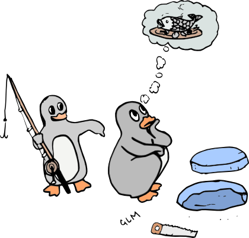

.. TroLUG documentation master file, created by
   sphinx-quickstart on Fri Jun  6 19:29:45 2014.
   You can adapt this file completely to your liking, but it should at least
   contain the root `toctree` directive.

Willkommen bei der Troisdorfer Linux User Group
===============================================

Die TroLUG (Troisdorfer Linux User Group) ist ein Club der Arbeiterwohlfahrt
Troisdorf (AWO) aus Frauen und Männern mit dem gemeinsamen Ziel, Wissen über
freie Software untereinander auszutauschen. Sie richtet sich an Anfänger und
Profis jeder Altersklasse, sowie private wie kommerzielle Nutzer. Die Treffen
finden jeweils am ersten Donnerstag eines Monats ab 19:00 Uhrin den
Räumlichkeiten der AWO in Troisdorf statt.

Contents:

.. toctree::
   :maxdepth: 2

   treffpunkt
   termine
   mailingliste
.. presse
.. logo
.. anderegruppen
.. hilfe
.. impressum

..
  Indices and tables
  ==================

  * :ref:`genindex`
  * :ref:`modindex`
  * :ref:`search`

