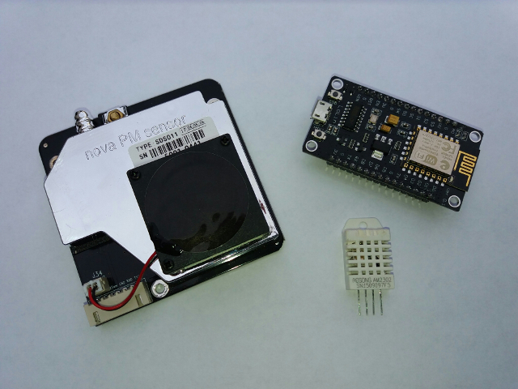

.. _luftdaten:

Workshop: Feinstaubsensor selbst bauen
======================================
Am 01.07.2017, 11:00-18:00
veranstaltet die Troisdorfer Linux User Group (TroLUG),
ein Club der Arbeiterwohlfahrt Troisdorf-Mitte,
einen
**Workshop: Feinstaubsensor selbst bauen**
Veranstaltungsort sind die
   
    | Seminarräume der AWO Troisdorf-Mitte
    | Agnes-Klein-Zentrum/Begegnungsstätte
    | Wilhelm-Hamacher-Platz 12
    | 53840 Troisdorf
   
`Treffpunkt auf OpenStreetMap.org <http://osm.org/go/0GISOY8w2?layers=H&way=178490074>`_

Inhalte
-------

Saubere Luft ist ein Thema für alle. Günstige Sensoren und Freie Software
erlauben es praktisch jedem Interessierten, ein Messgerät zu bauen. Die
Materialkosten für den Bausatz, den sich alle Teilnehmer vorher selbst besorgen
sollten, liegen bei ca. 30 Euro. Daraus entsteht eine kleine Messtation, die in
der Lage ist, die Temperatur und den Feinstaubgehalt in der Luft zu messen. Die
Daten werden gesammelt und über WiFi an ein zentrales Portal übertragen, wo sie
zusammen mit den Daten von über 1000 anderen Messtationen auf einer Karte
dargestellt werden. Alle Daten sind frei erhältlich und lassen sich beliebig
auswerten und darstellen.

Gemeinsam die Sensoren aufzubauen macht viel mehr Spaß, weshalb wir dazu einen
Workshop veranstalten. Lötstationen, Werkzeuge und Computer für das
Programmieren der Sensoren stehen bereit. Abgerundet werden soll der Workshop
mit Kurzvorträgen zum Thema Luftqualität sowie praktischen Tipps zur Auswertung
der Daten.

Ablauf
------
In Planung

Hinweise zur Bestellung der Bauteile
------------------------------------
Jeder, der eine Feinstaub-Messtation während des Workshops aufbauen möchte, muss
sich die dazu erforderlichen Bauteile rechtzeitig vorher selbst besorgen.

Folgende Bauteile werden benötigt:

* 1x Mikrocontroller-Board NodeMCU ESP8266
* 1x Feinstaubsensor SDS011
* 1x Temperatur-/Luftfeuchte-Sensor DHT22 bzw. AM2302
* 1x 5V-Netzteil mit USB Anschluss, z.B. Smartphone-Ladegerät (oder Solarzelle?)
* 1x Kabel zur Energieversorgung der Messtation, z.B. USB-Kabel
* 2x HT-Bögen, z.B. DN 75, 87° als Wetterschutz
* 1x Schlauch, ca. 20 cm und 6mm Durchmesser
* Satz Breadboard-Kabel, weiblich-weiblich

Die Bauteile sind am besten über Onlinehändler zu beziehen. Teilweise
bestehen erhebliche Preisunterschiede:

* https://www.aliexpress.com/
* https://eckstein-shop.de/

Bei einigen ausländischen Onlinehändlern, sind **lange Lieferzeiten von
teilweise mehreren Wochen** zu beachten. Sammelbestellungen aus dem Ausland
sind wegen der Zollgebühren und Einfuhrumsatzsteuer i.d.R. nicht lohnenswert.

Fragen zu Bestellmöglichkeiten können unter luftdaten@trolug.de gestellt
werden.

Werkzeuge und Verbrauchsmaterial
--------------------------------
Lötstationen, Werkzeug und Verbrauchsmaterial sind ausreichend vorhanden und
können gegen eine kleine Spende vor Ort verwendet werden.

Anmeldung
---------
Eine Anmeldung ist **nicht** erforderlich. Eine Email an luftdaten@trolug.de
erleichtert uns allerdings die Planung.

Kosten
------
Für die Teilnahme wird **kein Eintritt** verlangt. 

Die Arbeiterwohlfahrt (AWO) ermöglicht uns die Veranstaltung und hat nicht
unerhebliche Auslagen, angefangen von frischem Kaffee, Snacks, Mate und andere
Softdrinks, über die Bereitstellung eines Seminarraumes, Beamer, WLAN, bis hin
zum Toilettenpapier und nicht zuletzt unterstützen (ehrenamtliche) Mitarbeiter
der AWO uns mit Ihrer Arbeit sehr. Während der Veranstaltung steht eine
Spendendose bereit, in die Spenden für die AWO gegeben werden können. 

Detailplanung
-------------
Zur Detailplanung ist ein Etherpad eingerichtet: https://public.etherpad-mozilla.org/p/trolug-feinstaubsensoren.

| Organisation: Jan Grosser für die TroLUG
