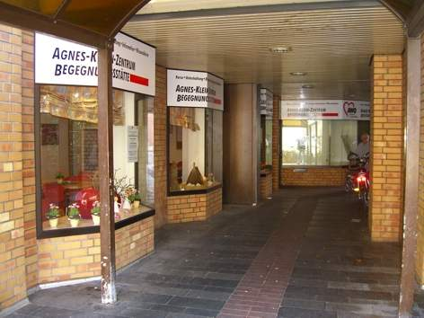

.. _treffpunkt:

Treffpunkt
==========

Die Treffen der TroLUG finden in der Regel am ersten Donnerstag eines Monats im Agnes-Klein-Zentrum der 
`Arbeiterwohlfahrt Troisdorf Mitte (AWO) <http://www.awo-troisdorf.de/>`_
statt:

| AWO Troisdorf
| Agnes-Klein-Zentrum/Begegnungsstätte
| Wilhelm-Hamacher-Platz 12
| 53840 Troisdorf

`TroLUG Treffpunkt auf OpenStreetMap.org <http://osm.org/go/0GISOY8w2?layers=H&way=178490074>`_

Das Programm beginnt pünktlich um 19:00 Uhr und endet um 21:00 Uhr dazwischen legen wir in der Regel eine kleine Pause ein.

Zur besseren Planung der Treffen bitten wir um eine **Anmeldung**. Hierzu
wird zu jedem Treffen ein Etherpad angelegt, in welches man sich eintragen
kann. 

Der **Eintritt ist kostenlos**. Trotzdem bitten wir die Teilnehmerinnen und Teilnehmer um
eine **Spende für die AWO**, die uns neben den Räumlichkeiten und Energie
auch Getränke, Beamer und Internetzugang und vieles weitere mehr zur
Verfügung stellt. Traditionell lassen wir die Abende nach einem Treffen
gemütlich in einem der nahegelegenen Lokalen ausklingen.

Anfahrt zur TroLUG mit dem PKW
------------------------------
**Anfahrt von Bonn oder Köln:**

  * A 59, Abfahrt Troisdorf/Mondorf
  * An der Ampel links auf den Willy-Brandt-Ring
  * nach 2 km Kreisverkehr an der 3. Ausfahrt verlassen Richtung Troisdorf-Mitte/Theodor-Heuss-Ring
  * Dem Theodor-Heuss-Ring folgen bis zur Wilhelmstraße, in diese rechts abbiegen
  * Im `Parkhaus der Galerie Troisdorf <http://www.openstreetmap.org/?mlat=50.81389&mlon=7.15440#map=19/50.81389/7.15440>`_ kann geparkt werden, die Einfahrt befindet sich scharf rechts vor der kleinen Fußgängerbrücke
  * Es gibt dort einen `Ausgang "Wilhelm Hamacher Platz" <http://www.openstreetmap.org/?mlat=50.81486&mlon=7.15560#map=19/50.81486/7.15560>`_ (20 m von der AWO entfernt)

**Anfahrt von Hennef**

  * A 560, Abfahrt Sankt Augustin
  * An der Ampel rechts auf die B 56
  * An der Ampel rechts auif die B 56
  * Von der B 56 links abbiegen auf die L332
  * nach 2 km Kreisverkehr an der 1. Ausfahrt verlassen Richtung Troisdorf-Mitte/Theodor-Heuss-Ring
  * Dem Theodor-Heuss-Ring folgen bis zur Wilhelmstraße, in diese rechts abbiegen
  * Im `Parkhaus der Galerie Troisdorf <http://www.openstreetmap.org/?mlat=50.81389&mlon=7.15440#map=19/50.81389/7.15440>`_ kann geparkt werden, die Einfahrt befindet sich scharf rechts vor der kleinen Fußgängerbrücke
  * Es gibt dort einen `Ausgang "Wilhelm Hamacher Platz" <http://www.openstreetmap.org/?mlat=50.81486&mlon=7.15560#map=19/50.81486/7.15560>`_ (20 m von der AWO entfernt)

